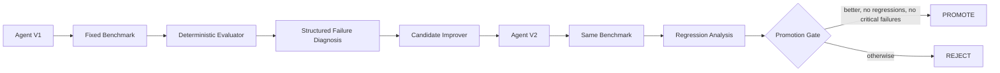

# AgentForge Mini

**AI proposes. AgentForge verifies.**

AgentForge Mini is a test-and-improve governance loop for autonomous agents, built for the **Syndicate by Maximor** hackathon. Instead of trusting that a new prompt or model response is "better," AgentForge measures a baseline, diagnoses failures, proposes a candidate, reruns the **same benchmark**, checks regressions, and only promotes the candidate when the evidence supports it.

## Why this exists

Agent improvement is easy to demo and surprisingly easy to fake. A score can rise because the benchmark changed, because an answer key leaked into the repair step, or because one task improved while another quietly regressed.

AgentForge treats improvement as a controlled promotion decision:



The local LLM is only a **proposal mechanism**. Evaluation and promotion remain deterministic.

## Live results

Verified locally with **Llama 3.1 8B via Ollama**:

| Domain | V1 | V2 | Regressions | Decision |
|---|---:|---:|---:|---|
| Technical support | **0.7119** | **1.0000** | **0** | **PROMOTE** |
| Structured extraction | **0.7500** | **0.8750** | **0** | **PROMOTE** |

The final local test suite contains **55 passing tests**.

AgentForge also demonstrated the failure paths the gate is meant to catch:

- An unconstrained extraction candidate fell from **0.7500 to 0.5000**, introduced **2 regressions**, and was **REJECTED**.
- Malformed JSON proposals were discarded safely, V1 was retained, and the candidate was **REJECTED** because it did not improve.

Those failures are not hidden demo debris. They are evidence that promotion is conditional rather than ceremonial.

## Two domains, one governance loop

### 1. Technical support

Seven debugging/support tasks cover HTTP auth, SQLite locking, Python errors, DNS, Git conflicts, environment variables, and HTTP timeouts.

The baseline starts at **4/7 passed, 0.7119 aggregate**. Failure diagnosis exposes missing requirements, the local model proposes repaired responses, and AgentForge reruns the same suite. The verified live candidate reached **7/7, 1.0000**, with zero regressions.

### 2. Structured business extraction

Four tasks cover an invoice, purchase order, support ticket, and shipment record. The evaluator scores required JSON fields individually.

The baseline starts at **0.7500**. The model receives the original document plus the names of fields that were wrong or missing, but **never the canonical expected values**. The verified live candidate reached **0.8750** with zero regressions and was promoted.

## Benchmark-integrity safeguards

AgentForge explicitly defends against "improvement" that is really benchmark leakage:

- `BenchmarkTask.expected_output` is not sent to the model during candidate generation.
- Required-keyword repairs are based on structured missing-requirement evidence.
- Exact-match failures fail closed when a safe repair would require exposing the answer key.
- `json_fields` diagnoses expose **field names only**, never canonical field values.
- For structured extraction, the model sees the original source document and diagnosed field names, not the baseline JSON object or expected answer object.
- Extraction repairs are **monotonic by construction**: only diagnosed fields may be overlaid; already-correct fields are preserved exactly.
- Extra model keys are ignored.
- Malformed, ambiguous, array, scalar, or prose-wrapped JSON proposals are rejected rather than guessed into shape.
- Model/network failures retain the baseline response rather than fabricating improvement.

## Promotion policy

A candidate is promoted only when all of the following hold:

1. Candidate aggregate score is strictly higher than baseline.
2. Regression count is zero.
3. Candidate has zero critical failures.

Otherwise AgentForge returns `REJECT` with a human-readable reason.

## Architecture

- `src/agentforge/models.py` — immutable benchmark, agent, evaluation, diagnosis, regression, and promotion models.
- `src/agentforge/benchmarks.py` — JSON benchmark loading and validation.
- `src/agentforge/execution.py` — deterministic runner plus `exact_match`, `required_keywords`, and `json_fields` evaluation.
- `src/agentforge/improvement.py` — diagnosis, deterministic reference improver, regression analysis, and promotion policy.
- `src/agentforge/ollama.py` — optional local Ollama-backed candidate improver with fail-closed behavior.
- `src/agentforge/ollama_demo.py` — live technical-support improvement loop.
- `src/agentforge/extraction_demo.py` — live second-domain extraction loop.
- `benchmarks/technical-support.json` — seven support/debugging tasks.
- `benchmarks/structured-extraction.json` — four business-document extraction tasks.
- `tests/` — benchmark integrity, evaluation, failure handling, regression, and promotion coverage.

## Built with Agent Orchestrator

AO was used throughout the build rather than added at the end as decorative provenance. The implementation progressed through isolated worker branches and reviewed pull requests:

- **PR #1** — foundation, benchmark models, loader, interfaces.
- **PR #2** — deterministic execution/evaluation and calibrated baseline.
- **PR #3** — failure diagnosis, candidate improvement, regression analysis, promotion gate; review caught and removed answer-key leakage.
- **PR #4** — optional local Ollama candidate generation with fail-closed network/model behavior.
- **PR #5** — second-domain structured extraction, monotonic JSON repair, structured output, and live cross-domain proof.

This history matters because the development process itself exercised the same principle as the product: proposed work was reviewed, challenged, corrected, and only then promoted to `main`.

## Quick start

Python 3.11+ is required.

```bash
python3 -m venv .venv
source .venv/bin/activate
python -m pip install -e '.[dev]'
pytest
```

Run the deterministic reference loop:

```bash
python -m agentforge.improvement_demo
```

Run the live local-model technical-support loop:

```bash
python -m agentforge.ollama_demo \
  --model llama3.1-8b:latest \
  --timeout 60
```

Run the live structured-extraction loop:

```bash
python -m agentforge.extraction_demo \
  --model llama3.1-8b:latest \
  --timeout 120
```

A local Ollama server and the named model are required for the live-model demos. The deterministic evaluation and test paths do not require an external API or third-party runtime dependency.

## Example verified outcome

```text
TECHNICAL SUPPORT
V1  0.7119  (4/7)
        ↓ local Llama proposal
V2  1.0000  (7/7)
regressions: none
PROMOTE

STRUCTURED EXTRACTION
V1  0.7500
        ↓ local Llama proposal
V2  0.8750
regressions: none
PROMOTE
```

## Current scope

AgentForge Mini is intentionally a focused hackathon prototype. It provides benchmarking, structured diagnosis, optional local-model proposal generation, candidate comparison, regression detection, and deterministic promotion gating. It does not yet provide persistence, a production API, authentication, distributed execution, or a full web dashboard.

**AgentForge doesn't ask whether an agent feels better. It tests whether it actually became better.**
